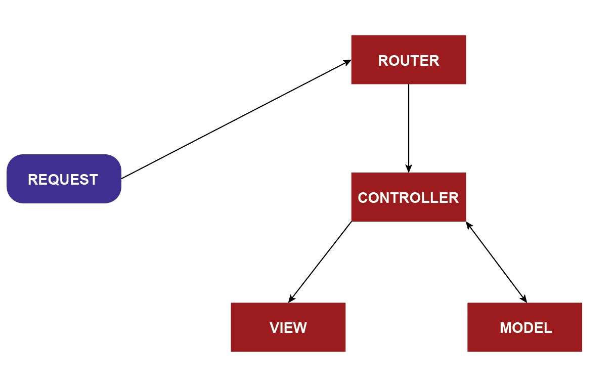

## Pengenalan
Laravel menggunakan seni bina **Model-View-Controller (MVC)** untuk mengatur aplikasi web anda. Berikut adalah cara mudah untuk memahaminya:

Bayangkan aplikasi web anda seperti sebuah **restoran**:

1. **Routes (Pelayan)**:
    - Routes dalam Laravel bertindak seperti seorang **pelayan**. Mereka menerima permintaan (contohnya, mengakses URL) dan menghantarnya ke tempat yang betul (Controller).
    - Contoh: Apabila anda mengunjungi `http://restoran.com/menu`, route akan menghantar permintaan ke bahagian "menu" dalam Controller.

2. **Controller (Tukang Masak)**:
    - Controller bertindak seperti **tukang masak** di dapur. Ia mengambil permintaan dari route (pelayan), memproses data, dan menyediakan respons.
    - Contoh: Controller mendapatkan senarai hidangan dari pangkalan data dan menentukan bagaimana ia akan dipaparkan kepada pelanggan.

3. **View (Hidangan di Pinggan)**:
    - View berfungsi seperti **hidangan yang dihidangkan kepada pelanggan**. Ia mengambil data yang telah diproses dan memaparkannya sebagai halaman web.
    - Contoh: View memformat senarai hidangan ke dalam halaman HTML yang menarik untuk pelanggan.

---

## Reka Bentuk Seni Bina MVC

---

## Contoh: MVC dalam Tindakan
Berikut adalah bagaimana permintaan ringkas dikendalikan dalam Laravel:
1. Seorang pengguna mengunjungi `http://restoran.com/menu`.
2. **Route**: Menghantar permintaan ke `MenuController`.
3. **Controller**: Mengambil data menu (`$dishes`) dan menghantarnya ke view.
4. **View**: Memaparkan menu sebagai halaman web.

---

